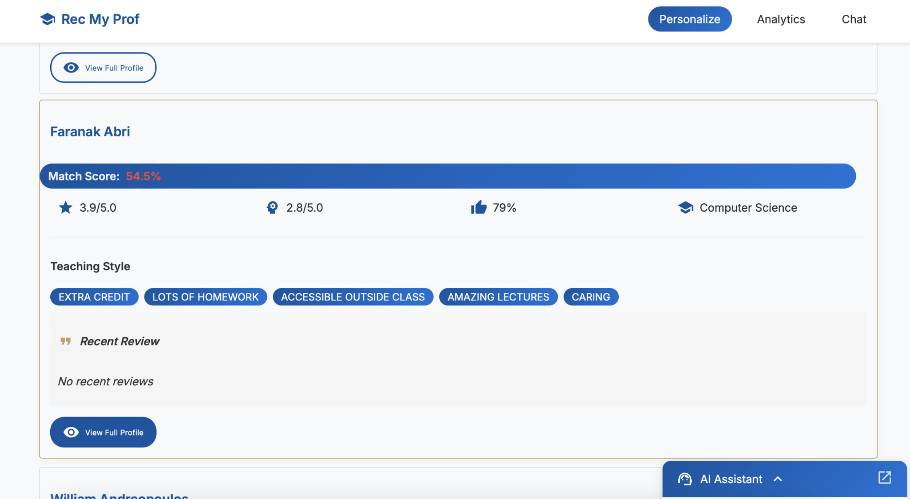
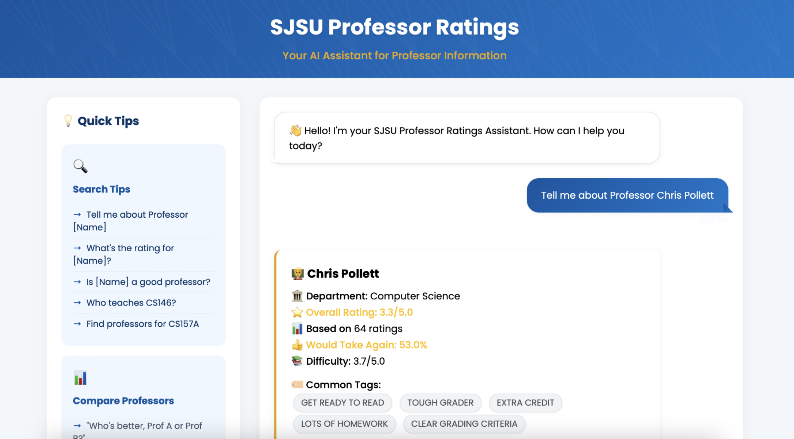
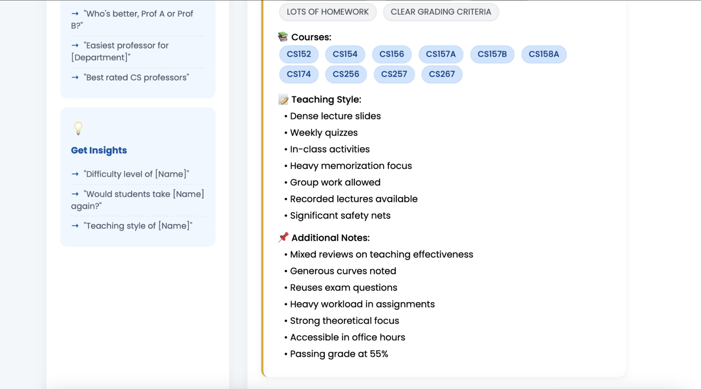
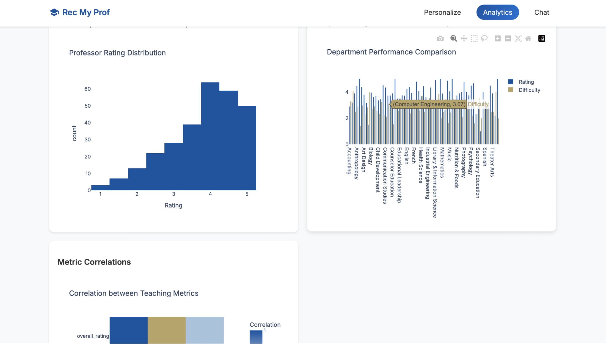

# 📌 Rec My Prof - Find Your Ideal Professor

Discover professors that match your learning style and academic goals at San José State University.

## 🌟 Features

- **Personalized Professor Recommendations**: Discover professors based on learning preferences and workload.
- **AI-Powered Chatbot**: Get instant professor insights, ratings, and course details using AI.
- **Advanced Filtering**: Search by department, professor rating, difficulty, and student feedback.
- **Comprehensive Analytics**: Visualize professor rating distributions, teaching styles, and department comparisons.
- **Interactive Visualizations**: Dynamic data representation with Plotly for an intuitive dashboard.
- **User-Friendly Interface**: A responsive UI with an intuitive design.

## 🖼️ Screenshots

Here are some screenshots of the application in action:











## 🛠️ Tech Stack

### Backend (API & Server)
- **FastAPI**: A modern, high-performance Python framework for building APIs.
- **Flask**: Used for handling specific routes and microservices.
- **SessionMiddleware**: Manages user sessions within FastAPI.

### Frontend (User Interface)
- **HTML/CSS**: For structuring and styling the web pages.
- **JavaScript**: Client-side interactivity and API requests.
- **Plotly**: Interactive data visualization for analytics dashboards.
- **Material Icons**: Used for a clean and professional UI.

### Data Handling & Processing
- **Pandas**: Data manipulation and analysis for professor data.
- **Jinja2**: Dynamic templating for HTML rendering.

### Environment Management
- **dotenv**: Loads environment variables securely from a .env file.

### AI & External APIs
- **OpenAI API**: AI-powered chatbot for professor insights.
- **Pinecone**: Vector database service used for efficient data retrieval.

### Data Visualization
- **Plotly**: Creates interactive charts and graphs to display professor performance insights.

## 📦 Installation & Setup

1. **Clone the Repository**
   ```bash
   git clone https://github.com/veedhibhanushali/rec-my-prof.git
   cd rec-my-prof
   ```

2. **Create a Virtual Environment**
   ```bash
   python -m venv venv
   source venv/bin/activate  # On macOS/Linux
   venv\Scripts\activate  # On Windows
   ```

3. **Install Dependencies**
   ```bash
   pip install -r requirements.txt
   npm install  # If frontend has additional dependencies
   ```

4. **Set Up Environment Variables**
   Create a `.env` file in the root directory and configure:
   ```plaintext
   OPENAI_API_KEY=your_openai_api_key
   PINECONE_API_KEY=your_pinecone_api_key
   DATABASE_URL=your_database_url
   GITHUB_CLIENT_ID=your_github_client_id
   GITHUB_CLIENT_SECRET=your_github_client_secret
   ```

5. **Run the Backend (FastAPI & Flask)**
   ```bash
   uvicorn main:app --host 0.0.0.0 --port 8000 --reload
   ```

6. **Run the Frontend**
   ```bash
   npm run dev  # or yarn dev
   ```
   The app will be available at [http://localhost:3000](http://localhost:3000)

## 📌 How It Works

1. **Select Your Learning Preferences**: Choose classroom experience, grading criteria, and workload.
2. **Filter Professors**: Adjust by department, rating, difficulty, and "Would Take Again" percentage.
3. **Explore Professor Profiles**: View ratings, teaching styles, workload, and real student reviews.
4. **AI Chatbot Support**: Get instant answers to professor-related questions.
5. **Analytics & Insights**: Interactive visual dashboards for rating distributions and departmental comparisons.

## 📊 Roadmap

- **Enhance AI Chatbot**: Improve responses using fine-tuned OpenAI models.
- **Add Student Reviews**: Allow students to submit and upvote reviews.
- **Compare Professors**: Side-by-side comparison of two professors.
- **Course Difficulty Insights**: Aggregate course difficulty ratings across multiple professors.

## 📢 Contributing

We welcome contributions! 🚀

1. Fork the repository
2. Create a feature branch
   ```bash
   git checkout -b feature-new-enhancement
   ```
3. Commit your changes
   ```bash
   git commit -m "Added new feature"
   ```
4. Push and create a pull request
   ```bash
   git push origin feature-new-enhancement
   ```

## 📜 License

This project is licensed under the MIT License. See LICENSE for details.

## ✨ Contact

- **Email**: bhanushaliveedhi@gmail.com
- **GitHub**: [veedhibhanushali](https://github.com/veedhibhanushali)
- **Live Demo**: [Rec My Prof](#)

